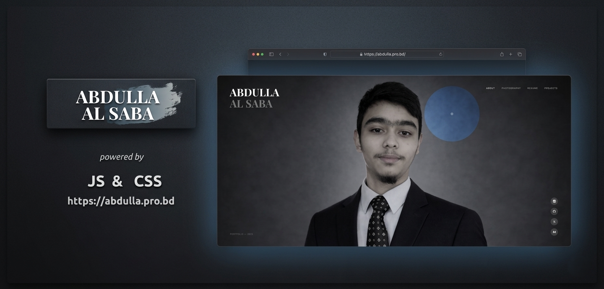

# Abdulla Al Saba — Personal Portfolio

> A creative developer and photographer's personal portfolio — crafting meaningful digital experiences at the intersection of technology, art, and human connection.

[](https://abdulla.pro.bd/)
[](https://github.com/abdullah-alsaba/ABDULLA-AL-SABA)

---

## Preview



---

## Overview

A personal portfolio website built entirely with vanilla HTML, CSS, and JavaScript. The site features a dark, cinematic aesthetic — designed to reflect my dual identity as a creative developer and photographer. It includes an about section, photography gallery, resume, and project showcase.

---

## Tech Stack

| Technology | Usage |
|---|---|
| HTML5 | Semantic markup & page structure |
| CSS3 | Styling, animations, layout (Flexbox/Grid) |
| JavaScript (ES6+) | Interactivity & DOM manipulation |

---

## Features

- **Cinematic Landing Page** — Full-viewport portrait with animated blob elements and smooth transitions
- **About Section** — Personal bio with skill tags (Node.js, React, MongoDB, REST APIs, Tailwind CSS, JavaScript)
- **Photography Gallery** — Dedicated section to showcase photography work
- **Resume Page** — Clean, viewable resume layout
- **Projects Showcase** — Highlights of development work
- **Social Links** — LinkedIn, GitHub, X (Twitter), and Email integrated into the UI
- **Responsive Design** — Fully responsive across all screen sizes
- **Micro-animations** — Subtle interactive hover effects and entrance animations

---

## Dependencies

This project uses **no external frameworks or npm packages**. It is built with pure vanilla web technologies:

- HTML5
- CSS3 (custom properties, keyframe animations)
- Vanilla JavaScript (ES6+)

No build tools, bundlers, or package managers required.

---

## Run Locally

### Option 1 — Open directly

```bash
# Clone the repository
git clone https://github.com/abdullah-alsaba/ABDULLA-AL-SABA.git

# Navigate into the folder
cd ABDULLA-AL-SABA

# Open in browser
open index.html        # macOS
start index.html       # Windows
xdg-open index.html    # Linux
```

### Option 2 — VS Code Live Server (recommended)

1. Open the project folder in VS Code
2. Right-click `index.html`
3. Select **"Open with Live Server"**

### Option 3 — Python server

```bash
python -m http.server 8000
# Visit: http://localhost:8000
```

---

## Project Structure

```
ABDULLA-AL-SABA/
├── index.html          # Main entry point
├── favicon/            # Favicon assets
├── photography/        # Photography gallery assets
├── profile/
│   └── abdulla.png     # Portfolio mockup image
└── CNAME               # Custom domain config
```

---

## Links

| | |
|---|---|
| 🌐 **Live Site** | [abdulla.pro.bd](https://abdulla.pro.bd/) |
| 💻 **GitHub Repo** | [github.com/abdullah-alsaba/ABDULLA-AL-SABA](https://github.com/abdullah-alsaba/ABDULLA-AL-SABA) |

---

<p align="center">Designed & built by <strong>Abdulla Al Saba</strong> — Portfolio © 2025</p>
